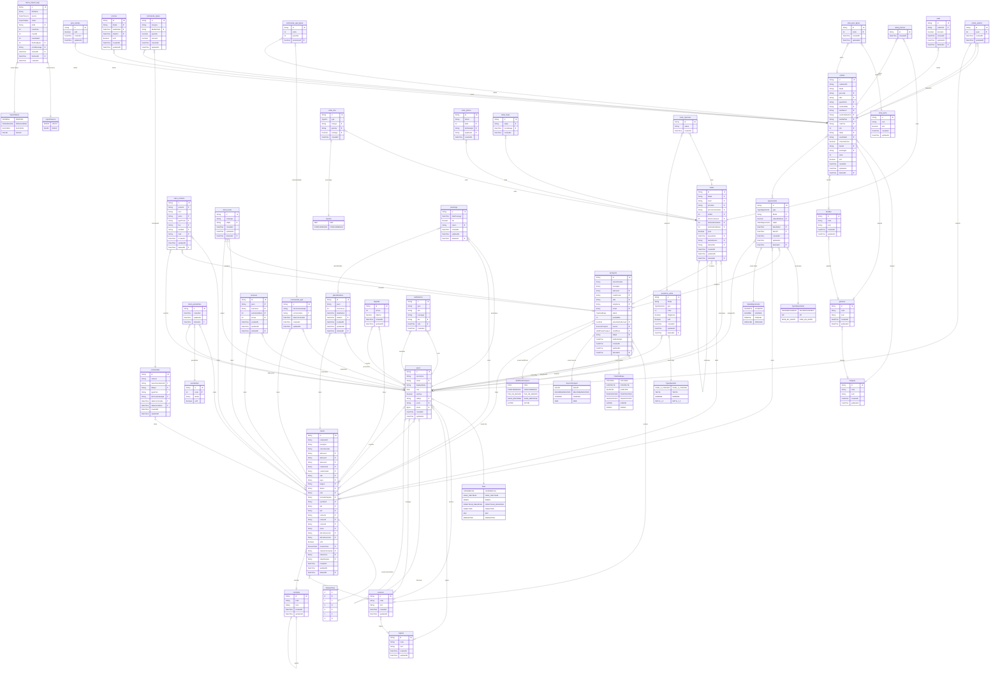

```mermaid
erDiagram

        Role {
            COMMERCIAL COMMERCIAL
CHEF_SECTEUR CHEF_SECTEUR
ADMIN ADMIN
DIRECTEUR_REGIONAL DIRECTEUR_REGIONAL
DIRECTION DIRECTION
ADV ADV
MARKETING MARKETING
        }
    


        ImportSource {
            MINOS MINOS
AS400 AS400
        }
    


        ImportStatus {
            PENDING PENDING
PROCESSING PROCESSING
SUCCESS SUCCESS
FAILED FAILED
        }
    


        NiveauClass {
            A A
B B
C C
D D
E E
F F
G G
        }
    


        TypeDn {
            ABC ABC
CONCURRENCE CONCURRENCE
        }
    


        TypeQuestion {
            CASE_A_COCHER CASE_A_COCHER
TEXTE TEXTE
NOMBRE NOMBRE
NOTE_1_5 NOTE_1_5
        }
    


        PipelineEtape {
            NOUVEAU NOUVEAU
CONTACTE CONTACTE
QUALIFIE QUALIFIE
PROPOSITION PROPOSITION
NEGOCIATION NEGOCIATION
GAGNE GAGNE
PERDU PERDU
        }
    


        SourceProspect {
            SALON SALON
RECOMMANDATION RECOMMANDATION
TERRAIN TERRAIN
WEB WEB
        }
    


        MotifPerteProspect {
            PRIX PRIX
CONCURRENCE CONCURRENCE
PAS_DE_BESOIN PAS_DE_BESOIN
SANS_REPONSE SANS_REPONSE
AUTRE AUTRE
        }
    


        TypeOpportunite {
            REFERENCEMENT REFERENCEMENT
OP OP
MISE_EN_AVANT MISE_EN_AVANT
        }
    


        StatutOpportunite {
            OUVERTE OUVERTE
GAGNEE GAGNEE
PERDUE PERDUE
ANNULEE ANNULEE
        }
    
  "users" {
    String id "🗝️"
    String username 
    String email "❓"
    String displayName 
    Role role 
    Boolean isActive 
    String idRepr "❓"
    String poste "❓"
    Bytes photo "❓"
    DateTime createdAt 
    DateTime updatedAt 
    }
  

  "regions" {
    String id "🗝️"
    String code 
    String nom 
    DateTime createdAt 
    DateTime updatedAt 
    }
  

  "secteurs" {
    String id "🗝️"
    String code 
    String nom 
    DateTime createdAt 
    DateTime updatedAt 
    }
  

  "clients" {
    String id "🗝️"
    String codeAs400 
    String enseigne 
    String raisonSociale 
    String adresse1 "❓"
    String adresse2 "❓"
    String adresse3 "❓"
    String codePostal "❓"
    String codePostal2 "❓"
    String ville "❓"
    String pays "❓"
    String langue "❓"
    String devise "❓"
    String siret "❓"
    String formeEntreprise "❓"
    String eanClient "❓"
    String tel1 "❓"
    String tel2 "❓"
    String contact1 "❓"
    String contact2 "❓"
    String contact3 "❓"
    String email "❓"
    String idCommercial1 "❓"
    String idCommercial2 "❓"
    Boolean actif 
    NiveauClass niveauClass "❓"
    String statutCommande "❓"
    String statutLivre "❓"
    String statutFacture "❓"
    DateTime createdAt 
    DateTime updatedAt 
    DateTime deletedAt "❓"
    }
  

  "centrales" {
    String id "🗝️"
    String code 
    String nom 
    DateTime createdAt 
    DateTime updatedAt 
    }
  

  "periodicites" {
    String id "🗝️"
    Int code "❓"
    String libelle 
    Boolean actif 
    }
  

  "client_contacts" {
    String id "🗝️"
    String prenom "❓"
    String nom 
    String poste "❓"
    String typePoste "❓"
    String fixe "❓"
    String portable "❓"
    String mail "❓"
    DateTime createdAt 
    DateTime updatedAt 
    DateTime deletedAt "❓"
    }
  

  "client_notes" {
    String id "🗝️"
    String remarque 
    String idApk "❓"
    DateTime createdAt 
    DateTime updatedAt 
    DateTime deletedAt "❓"
    }
  

  "client_periodicites" {
    String id "🗝️"
    DateTime createdAt 
    DateTime updatedAt 
    DateTime deletedAt "❓"
    }
  

  "marques" {
    String id "🗝️"
    String code 
    String nom 
    DateTime createdAt 
    DateTime updatedAt 
    }
  

  "gammes" {
    String id "🗝️"
    String code 
    String nom 
    DateTime createdAt 
    DateTime updatedAt 
    }
  

  "familles" {
    String id "🗝️"
    String code 
    String nom 
    DateTime createdAt 
    DateTime updatedAt 
    }
  

  "articles" {
    String id "🗝️"
    String codeAs400 
    String libelle 
    String gencode "❓"
    String idIta "❓"
    String typeArticle "❓"
    String sousFamille "❓"
    String familleAcd "❓"
    String sousFamilleAcd "❓"
    String famillePlan "❓"
    String codeTva "❓"
    Int pcb "❓"
    String statut "❓"
    String sousStatut "❓"
    Boolean retourAutorise 
    String details "❓"
    String avantages "❓"
    Int stock 
    Boolean actif 
    DateTime createdAt 
    DateTime updatedAt 
    DateTime deletedAt "❓"
    }
  

  "tarifs" {
    String id "🗝️"
    String codeTarif "❓"
    Decimal montant 
    DateTime createdAt 
    DateTime updatedAt 
    DateTime deletedAt "❓"
    }
  

  "article_switchs" {
    String id "🗝️"
    Int seuil "❓"
    DateTime createdAt 
    DateTime updatedAt 
    }
  

  "promos" {
    String id "🗝️"
    String libelle "❓"
    DateTime dateDebut "❓"
    DateTime dateFin "❓"
    Boolean actif 
    DateTime createdAt 
    DateTime updatedAt 
    }
  

  "pem_articles" {
    String id "🗝️"
    Boolean actif 
    DateTime createdAt 
    DateTime updatedAt 
    }
  

  "strat_pems" {
    String id "🗝️"
    String nom 
    Boolean actif 
    DateTime createdAt 
    DateTime updatedAt 
    }
  

  "strat_pem_lignes" {
    String id "🗝️"
    Int ordre "❓"
    DateTime createdAt 
    DateTime updatedAt 
    }
  

  "visites" {
    String id "🗝️"
    String idApk "❓"
    String motif "❓"
    String pmcEtat "❓"
    String pmcCommentaire "❓"
    Int dnAbc "❓"
    Int dnConcurrence "❓"
    Int dnGondoleHaute "❓"
    Int dnGondoleBasse "❓"
    Boolean pem 
    DateTime queueDate "❓"
    String alerteRaison "❓"
    String alerteObs "❓"
    DateTime createdAt 
    DateTime updatedAt 
    DateTime deletedAt "❓"
    }
  

  "visite_dns" {
    String id "🗝️"
    TypeDn type 
    String marque "❓"
    String gamme "❓"
    Decimal metrage "❓"
    DateTime createdAt 
    }
  

  "visite_photos" {
    String id "🗝️"
    String fichier 
    Int taille "❓"
    String idVisiteApk "❓"
    String appName "❓"
    DateTime createdAt 
    }
  

  "visite_steps" {
    String id "🗝️"
    String etape "❓"
    DateTime horodatage "❓"
    DateTime createdAt 
    }
  

  "questions_visite" {
    String id "🗝️"
    String libelle 
    TypeQuestion type 
    Int ordre 
    Boolean obligatoire 
    Boolean actif 
    DateTime createdAt 
    DateTime updatedAt 
    DateTime deletedAt "❓"
    }
  

  "visite_reponses" {
    String id "🗝️"
    String valeur 
    DateTime createdAt 
    }
  

  "visite_promos" {
    String id "🗝️"
    DateTime createdAt 
    }
  

  "plannings" {
    String id "🗝️"
    DateTime datePassage 
    Boolean fait 
    String raison "❓"
    DateTime createdAt 
    DateTime updatedAt 
    DateTime deletedAt "❓"
    }
  

  "plannifications" {
    String id "🗝️"
    String jours 
    Int recurrence 
    DateTime dateDebut 
    DateTime dateFin "❓"
    DateTime createdAt 
    DateTime updatedAt 
    DateTime deletedAt "❓"
    }
  

  "tournees" {
    String id "🗝️"
    String jours "❓"
    String semaines "❓"
    Int semaineDebut "❓"
    Int annee "❓"
    DateTime createdAt 
    DateTime updatedAt 
    DateTime deletedAt "❓"
    }
  

  "commandes" {
    String id "🗝️"
    String numero 
    String raisonSocialeCmd "❓"
    String idRepr "❓"
    String typeCmd "❓"
    String idCommandeApk "❓"
    DateTime dateCommande "❓"
    DateTime dateAnnulation "❓"
    DateTime createdAt 
    DateTime updatedAt 
    }
  

  "commande_lignes" {
    String id "🗝️"
    String noLigne 
    String libelleArticle "❓"
    Decimal quantite 
    Decimal montant 
    DateTime createdAt 
    DateTime updatedAt 
    }
  

  "commandes_apk" {
    String id "🗝️"
    String idCommandeApk 
    String commentaire "❓"
    DateTime dateCommande 
    DateTime createdAt 
    DateTime updatedAt 
    }
  

  "commande_apk_lignes" {
    String id "🗝️"
    Int ordre 
    Int quantite 
    Decimal prixIndicatif "❓"
    }
  

  "prospects" {
    String id "🗝️"
    String raisonSociale 
    String enseigne 
    String adresse1 "❓"
    String codePostal "❓"
    String ville "❓"
    String telephone "❓"
    String email "❓"
    PipelineEtape statut 
    Int probabilite 
    Decimal potentielCaAnnuel "❓"
    SourceProspect source "❓"
    MotifPerteProspect motifPerte "❓"
    String idApk "❓"
    DateTime lastActivityAt 
    DateTime createdAt 
    DateTime updatedAt 
    DateTime deletedAt "❓"
    }
  

  "opportunites" {
    String id "🗝️"
    TypeOpportunite type 
    String libelle "❓"
    Decimal valeurEstimee "❓"
    StatutOpportunite statut 
    DateTime dateDebut "❓"
    DateTime dateFin "❓"
    DateTime createdAt 
    DateTime updatedAt 
    DateTime deletedAt "❓"
    }
  

  "minos_import_logs" {
    String id "🗝️"
    String fileName 
    ImportSource source 
    ImportStatus status 
    String jobId "❓"
    Int rowsTotal 
    Int rowsOk 
    Int rowsFailed 
    Int fileSizeBytes "❓"
    String errorMessage "❓"
    DateTime startedAt "❓"
    DateTime finishedAt "❓"
    DateTime createdAt 
    }
  

  "objectifs" {
    String id "🗝️"
    Int annee 
    Decimal cibleCa 
    DateTime createdAt 
    DateTime updatedAt 
    }
  

  "notifications" {
    String id "🗝️"
    String type 
    String titre 
    String message 
    String lien "❓"
    DateTime luAt "❓"
    DateTime createdAt 
    }
  
    "users" |o--|| "Role" : "enum:role"
    "users" }o--|o secteurs : "secteur"
    "users" }o--|o regions : "region"
    "users" |o--|o users : "directeur"
    "users" o{--}o "clients" : ""
    "secteurs" }o--|o regions : "region"
    "secteurs" }o--|o users : "manager"
    "clients" |o--|o "NiveauClass" : "enum:niveauClass"
    "clients" }o--|o secteurs : "secteur"
    "clients" }o--|o centrales : "centrale"
    "clients" }o--|o users : "creePar"
    "centrales" |o--|o centrales : "parent"
    "client_contacts" }o--|o clients : "client"
    "client_contacts" }o--|o prospects : "prospect"
    "client_contacts" }o--|o users : "creePar"
    "client_notes" }o--|o clients : "client"
    "client_notes" }o--|o prospects : "prospect"
    "client_notes" }o--|o users : "auteur"
    "client_periodicites" }o--|| clients : "client"
    "client_periodicites" }o--|| periodicites : "periodicite"
    "client_periodicites" }o--|o users : "affectePar"
    "gammes" }o--|o marques : "marque"
    "familles" }o--|o gammes : "gamme"
    "articles" }o--|o marques : "marque"
    "articles" }o--|o gammes : "gamme"
    "articles" }o--|o familles : "famille"
    "articles" o{--}o "opportunites" : ""
    "tarifs" }o--|| articles : "article"
    "article_switchs" }o--|| articles : "article"
    "article_switchs" }o--|| articles : "cible"
    "article_switchs" }o--|o users : "creePar"
    "promos" }o--|| articles : "article"
    "pem_articles" }o--|| articles : "article"
    "strat_pem_lignes" }o--|| strat_pems : "stratPem"
    "strat_pem_lignes" }o--|o articles : "article"
    "visites" }o--|| users : "promoteur"
    "visites" }o--|o clients : "client"
    "visites" }o--|o prospects : "prospect"
    "visites" |o--|o visites : "visiteLiee"
    "visite_dns" }o--|| visites : "visite"
    "visite_dns" |o--|| "TypeDn" : "enum:type"
    "visite_photos" }o--|| visites : "visite"
    "visite_steps" }o--|| visites : "visite"
    "questions_visite" |o--|| "TypeQuestion" : "enum:type"
    "questions_visite" }o--|o users : "creePar"
    "visite_reponses" }o--|| visites : "visite"
    "visite_reponses" }o--|| questions_visite : "question"
    "visite_promos" }o--|| visites : "visite"
    "visite_promos" }o--|o articles : "article"
    "plannings" }o--|| users : "promoteur"
    "plannings" }o--|| clients : "client"
    "plannings" }o--|o plannifications : "plannification"
    "plannifications" }o--|| users : "promoteur"
    "plannifications" }o--|| clients : "client"
    "tournees" }o--|| users : "promoteur"
    "tournees" }o--|| clients : "client"
    "commandes" }o--|o clients : "client"
    "commande_lignes" }o--|| commandes : "commande"
    "commande_lignes" }o--|o articles : "article"
    "commandes_apk" }o--|| users : "promoteur"
    "commandes_apk" }o--|| clients : "client"
    "commande_apk_lignes" }o--|| commandes_apk : "commandeApk"
    "commande_apk_lignes" }o--|| articles : "article"
    "prospects" }o--|o secteurs : "secteur"
    "prospects" }o--|o users : "assignedTo"
    "prospects" }o--|o users : "createdBy"
    "prospects" |o--|| "PipelineEtape" : "enum:statut"
    "prospects" |o--|o "SourceProspect" : "enum:source"
    "prospects" |o--|o "MotifPerteProspect" : "enum:motifPerte"
    "prospects" |o--|o clients : "client"
    "opportunites" |o--|| "TypeOpportunite" : "enum:type"
    "opportunites" }o--|o prospects : "prospect"
    "opportunites" }o--|o clients : "client"
    "opportunites" |o--|| "StatutOpportunite" : "enum:statut"
    "opportunites" }o--|o users : "assignedTo"
    "minos_import_logs" |o--|| "ImportSource" : "enum:source"
    "minos_import_logs" |o--|| "ImportStatus" : "enum:status"
    "objectifs" }o--|| clients : "client"
    "objectifs" }o--|o users : "creePar"
    "notifications" }o--|| users : "user"
    "notifications" }o--|o users : "emetteur"
```
